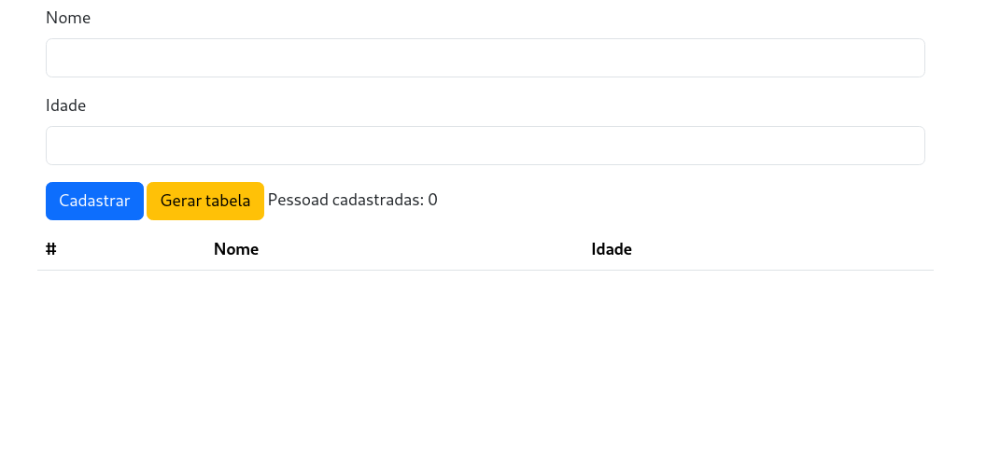
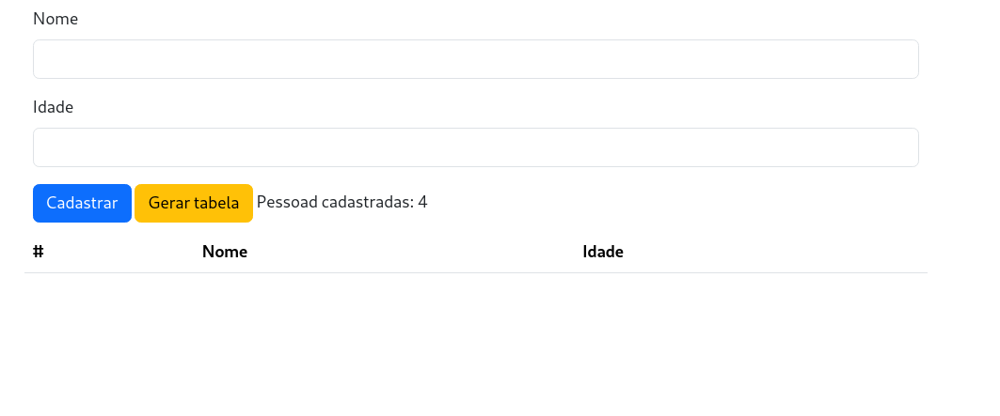
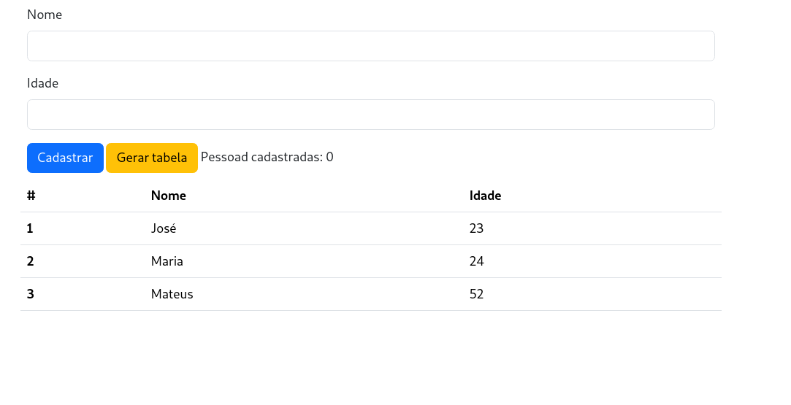

# BankOfPeople
Um projeto que trabalha com objetos em javascript, nele você ira cadastrar uma serie de pessoas com nome e idade podendo gerar uma tabela com estes dados após alguns cadastros

## Funcionalidades
- Cadastrado de objetos
- Geração de tabela (não exportavel)

## Tecnologias 
- HTML
- CSS 
- JAVASCRIPT 

## Screenshots

| Campos vazio | Pessoas cadastradas | Tabela gerada | 
|:--------------:|:--------------:|:--------------:|
|  |  |  |


## Como rodar o projeto

### Clone o repositorio
```bash
    git clone https://github.com/LacamJC/BankOfPeople.git
    cd BankOfPeople    
```

### Após isso abra o arquivo index.html em seu navegador e teste as funcionadlidades !


## Atribuições

Ideia tirada do repositorio https://github.com/florinpop17/app-ideas
